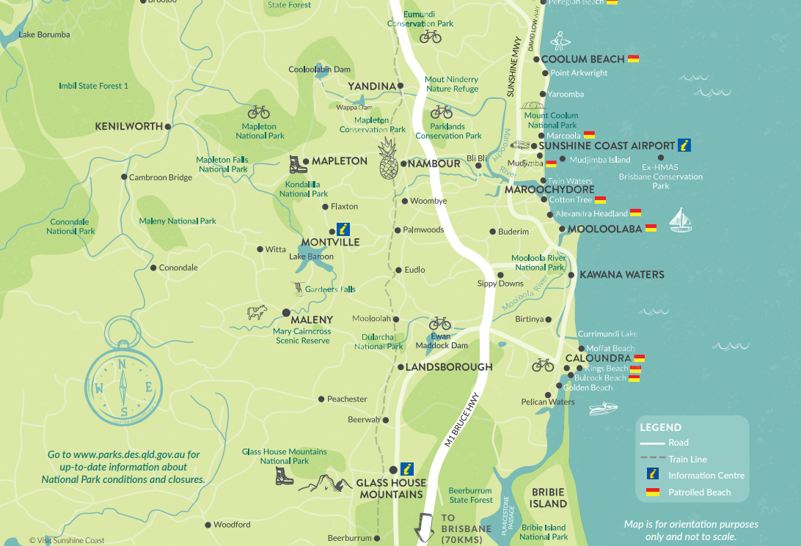

# 🌊 Coastal Risk Analysis – SE Queensland

This project analyzes coastal wave and tide data from the Queensland Government to identify **compound hazard events** such as storm surge overlapping with extreme wave height. The analysis was developed as part of IFN619 – Foundational Techniques in Data Science.

---

## 📌 Project Overview

> How can we identify when and where coastal conditions pose the highest emergency risk?

This project combines wave and storm tide data from SE Queensland stations such as Gild Coast, Brisbane, and Sunshine Coast during a recent 7-day period. The analysis evaluates **combined risk timing**, overlaps in significant wave height and water level, and links observations to **High Astronomical Tide (HAT)** thresholds.

---

## 🧠 Skills Demonstrated

- Real-world data cleaning & preprocessing (time series, CSVs)  
- Compound event detection (wave + storm surge)  
- Dual-axis visualizations with thresholds  
- Data storytelling for strategic emergency insights  
- Organized GitHub project structure

---

## 📁 Folder Structure

**Project Layout:**
- `data/` – Raw coastal CSV data
- `visuals/` – Key figures & dual-axis plots
- `notebooks/` – Main Jupyter notebook
- `LICENSE` – MIT license
- `README.md` – This file

---

## 📄 Main Notebook

**File:** `notebooks/IFN619_UA1-FoundationalTechniques_VaishnavRai_N11484209.ipynb`

This notebook includes:
- Wave + tide data loading & alignment  
- Missing value handling and time conversion  
- Merging datasets for combined event analysis  
- Threshold detection using HAT levels  
- Final risk timing and visualizations

---

## 📊 Sample Visuals

---

## 📦 Data Source

[Wave and Storm Tide Monitoring – QLD Gov Open Data](https://data.qld.gov.au/dataset/coastal-wave-monitoring)

---

## ⚠️ Disclaimer

This is a university coursework project and is not intended for operational emergency use.  
Insights are based on sample time periods and simplified logic.

---

## 🪪 License

This project is licensed under the **MIT License** – see [LICENSE](LICENSE) for details.
